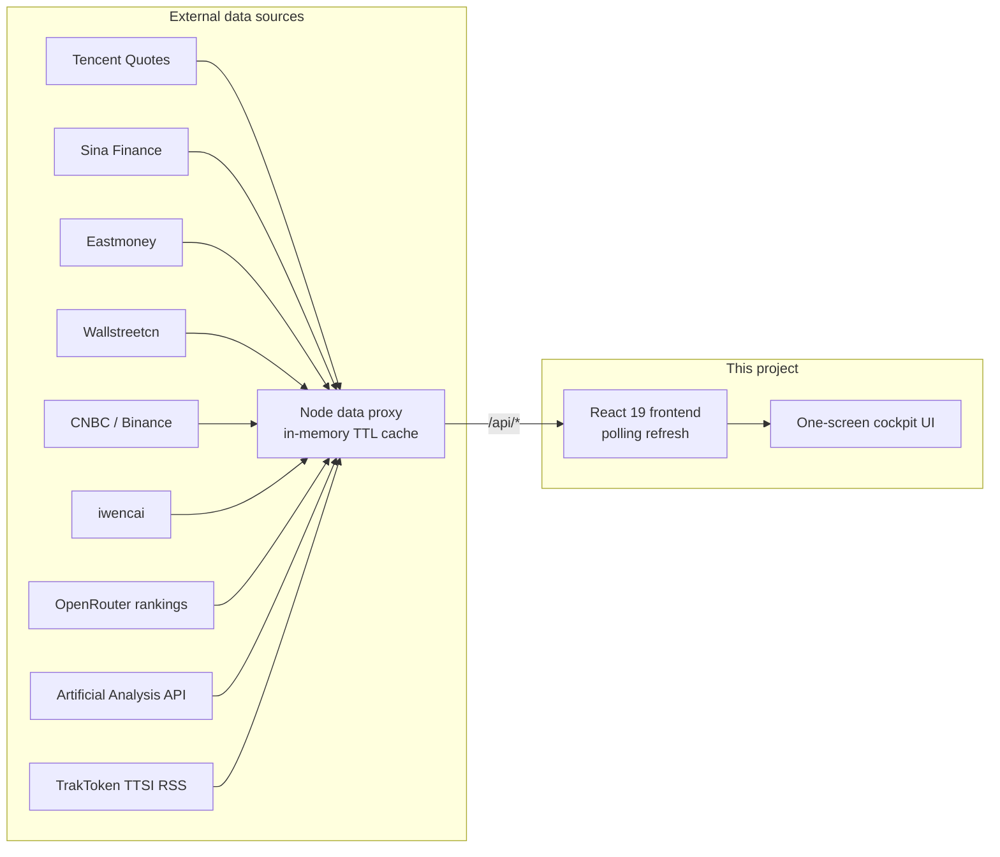

<div align="center">


# 📊 Market Research Cockpit

**A one-screen real-time market dashboard for financial & industry research**

A-shares / HK / US stocks · Commodities · US Treasury yields · Sector heat · Money flow · 7×24 news flash · Industry-chain watchlists

[简体中文](README_CN.md)

[](https://react.dev)
[](https://vite.dev)
[](https://www.typescriptlang.org)
[](https://tailwindcss.com)
[](https://nodejs.org)
[](https://github.com/theBigGavin/marketingdashboard)
[](LICENSE)

🚀 **Live demo**: https://mrd.hermes.cc.cd — *no API keys, no login, works instantly*

</div>


## ✨ Features

- **🌍 Global markets on one screen** — SSE / SZSE / Hang Seng / Dow / Nasdaq / S&P 500 / VIX / USD-CNY, with minute-level index charts side by side
- **🥇 Commodities & crypto** — NY gold/silver, London gold, SHFE gold, LME copper, crude oil, BTC — live prices with intraday curves
- **💵 US Treasury monitor** — 10Y / 2Y yields, 2s10s spread, yield-curve shape and its month-by-month history back to 2001
- **🔥 Sector heat radar** — Industry / concept sector rankings; click a sector to drill into constituents, leading stocks and money flow
- **💰 Money-flow tracking** — Top stocks by main-force net inflow, minute-level cumulative sector flow curves, hot / top-gainer / top-loser lists
- **⛓️ Industry-chain panorama** — Semiconductors, AI compute, EV, robotics, innovative drugs and more; upstream/midstream/downstream tickers linked to live quotes. Stock lists can be edited manually or fetched automatically from iwencai
- **🤖 AI cockpit** — OpenRouter daily rankings API tracking token-consumption trends of 50+ global LLM providers (7d–1y ranges), stacked-area share charts by provider/country/region, 60+ day long-range history
- **💹 LLM price-competition watch** — Four panels on a 2×3 grid: TTSI spend-index trend (weighted / closed-source / open-source price lines on a 0-based axis, multi-month full history from a local `ttsi.csv` CC BY 4.0 archive merged with the daily RSS tail), model price table (~400 models, sortable by intelligence / input / output / task cost), value scatter (intelligence index × task cost on a log axis, vendor colors), and a price-cut / share-shift event feed from TrakToken daily annotations
- **🪟 Earnings window (/fin)** — Earnings-season macro view: disclosure calendar (14-day rhythm bars + today's list), earnings forecasts (beat/miss stats bar + profit-range details), industry profit ranking (scale × momentum dual encoding), stock profit ranking (by amount / growth), plus per-company 12-quarter trends (revenue/profit bars + ROE/gross/net margin lines)
- **🏷️ Commodity prices page (/goods)** — Main-contract futures daily trends across 6 groups (precious / base / ferrous / energy-chem / agri / international energy) with 30d–365d ranges, plus Sunsirs spot quotes (accumulated daily) and spot–futures basis tables
- **📰 7×24 news flash** — Scrolling global financial news with auto-highlighted macro keywords and industry-chain mentions
- **🖥️ Installable desktop app** — Built-in PWA support (Web Manifest + Service Worker); install from the browser address bar and run in a standalone window
- **🍎 Native macOS app** — Swift WKWebView thin shell, follows the same pattern as Android TV
- **📺 Android TV app** — Native WebView shell (`android-tv/`) with D-pad spatial navigation, fullscreen panel zoom (proportional scaling + slideshow), split-flap ticker, tuned for legacy engines and weak GPUs
- **📱 iOS Scripting script** — TypeScript/TSX script (`scriptable/`, mirrored to `theBigGavin/mrd-scripting`) that wraps the cockpit in the Scripting app's WebView: TV mode via `?tv=1`, forced landscape, safe-area-free fullscreen, Liquid Glass exit button, local splash screen with the mrd logo (breathing animation) and a white-screen-free transition into the live dashboard
- **⚡ Zero-dependency data service** — Built-in Node proxy aggregates public market-data endpoints with in-memory caching; most endpoints need no API key and work out of the box

## 🏗️ Architecture



- The frontend prefers the bundled Node proxy; when it is unavailable, some endpoints (Tencent / Wallstreetcn) gracefully fall back to direct browser connections
- **Unified client quote hub**: all panel prices / changes come from a single client-side quote hub (`src/lib/market.ts`) that batch-fetches every 5s and distributes one snapshot — the same ticker renders the same frame everywhere; server-side quotes are cached per code (5s, aligned with the client poll loop) and watch-set changes only fetch the new codes
- Per-endpoint server cache TTLs (5s for quotes up to 24h for sector membership), bounded capacity (LRU + periodic sweep), no database, no external storage
- **Upstream-friendly under many concurrent users**: per-code TTL caches + in-flight dedup share one upstream fetch across concurrent cache misses, failure backoff (5s→2min negative caching) keeps a downed upstream from being hammered, browser-direct fallbacks are throttled per code, and `/api/stats` exposes request / upstream-fetch / 429 counters
- Spot prices are collected by the server every 4 hours into local history files — history grows day by day without the frontend being online
- Single-process production: one port serves both the API and the built frontend

## 🚀 Quick start

### Prerequisites

- Node.js 18+
- `curl` available on the system (used by some proxy endpoints)

### Local development

```bash
npm install     # or pnpm install
npm run dev
```

- Frontend dev server: <http://localhost:3000>
- Data proxy: <http://localhost:3001> (Vite proxies `/api` to it automatically)

### Production

```bash
npm run build   # builds to dist/
# Optional: configure API keys (AI panels)
#   echo 'OPENROUTER_API_KEY=sk-or-v1-xxxx' > server/.env          # AI cockpit usage panel
#   echo 'ARTIFICIAL_ANALYSIS_API_KEY=aa_xxxx' >> server/.env      # LLM price panels
# Optional: full TTSI history — download ttsi.csv from traktoken.com and
# place it at server/data/ttsi.csv (CC BY 4.0). Without it the trend
# panel falls back to the 60-day RSS tail automatically.
npm start       # single process, visit http://localhost:3000
```

### Docker

```bash
docker build -t market-cockpit .
docker run -p 3000:3000 market-cockpit
```

### Install as a desktop app (PWA)

Open the deployed page in Chrome / Edge and click the **install icon** on the right of the address bar (or menu → "Install Market Research Cockpit") to run it as a standalone desktop app with offline-cached static assets and its own icon.

> Note: market data is fetched live; offline only the app shell works.

### macOS Desktop App

The `macos/` directory contains a native Swift WKWebView shell. Same pattern as Android TV — a thin native window around the same web UI.

**Prerequisites**: Xcode

```bash
open macos/MarketCockpit.xcodeproj  # Open in Xcode, press ⌘R to build & run
```

Loads `http://localhost:3000/?desktop=1` by default (run `npm start` first).

### Android TV app

The `android-tv/` directory contains a native WebView shell (zero third-party dependencies) that brings the cockpit to Android TVs and set-top boxes. The web app enters TV mode via `?tv=1` and shares the same codebase as the desktop version.

**Remote-control model**

- **D-pad spatial navigation**: panels, nav links, tabs and scroll regions are all focusable (cyan highlight ring), scored by edge distance + axis overlap so the candidate straight ahead always wins
- **OK**: zoom a panel / activate a button / switch pages
- **Zoom = fullscreen overlay**: the panel covers the screen with a dim backdrop, its content scaled up proportionally (CSS zoom, capped at 3x), while every other panel stays put — zero reflow
- **Inside the overlay**: ←/→ switches to the adjacent panel slideshow-style; ↑/↓ scrolls the content (at the top, one more ↑ jumps to the tab bar); tabs, board rows and the constituents sidebar are all reachable and operable
- **Back**: restore the zoomed panel → history back → exit; **Menu**: change the server URL
- **Split-flap ticker**: the top quote strip works like a departure board — 7 equal-width cards, one card flipping at a time every few seconds (a full-width scrolling layer is too much for weak TV GPUs; flipping only repaints a tiny region)
- **Splash screen**: breathing logo + progress indicator that fades out once the page is ready

**TV-mode adaptations** (no effect on desktop)

- Fixed 1920 CSS-px viewport so layout and font sizes are identical on any TV density; the shell computes the initial scale from the screen's dp width to fit exactly
- Legacy engine compatibility (< Chromium 88): fallbacks for `:where()`, `inset` and flex `gap`
- Weak-GPU optimizations: blur/shadows/animations disabled, clock and countdowns tick per minute, long lists trimmed (boards 200→40, news 60→25, rankings 30→15), quote polling slowed 5s→10s
- Debug badge in the corner: WebView engine version · build time · live FPS · JS heap · quote heartbeat (distinguishes "polling broken" from "market closed")

**Setup**

1. Build the APK: `cd android-tv && ./gradlew assembleDebug` — output at `app/build/outputs/apk/debug/app-debug.apk`
2. Sideload it onto the TV (`adb install app-debug.apk`, or copy via USB drive)
3. The app connects to the public deployment `https://mrd.hermes.cc.cd` by default — works out of the box; press the remote's menu key anytime to switch to a LAN address (run `npm start` on a computer and enter `http://<computer-ip>:3000`)

### iOS Scripting script

The `scriptable/` directory contains a **Scripting app** (scripting.fun) script that presents the cockpit inside a native WebView. It is also mirrored as a standalone repository [`theBigGavin/mrd-scripting`](https://github.com/theBigGavin/mrd-scripting) so it can be imported directly.

**Features**
- Loads `https://mrd.hermes.cc.cd/?tv=1` — TV mode (D-pad spatial navigation, tap-to-zoom panels, touch swipe to switch)
- Forced landscape, title-bar-free, safe-area-free fullscreen (`ignoresSafeArea`)
- Liquid Glass exit button (`buttonStyle="glass"`, iOS 26)
- Local splash screen: mrd logo with breathing animation + spinner, then a seamless dark transition into the dashboard (no white flash)

**Install (one tap)**

Open the import link on your iPhone (requires the Scripting app, iOS 26+):

```
https://scripting.fun/import_scripts?urls=%5B%22https%3A%5C%2F%5C%2Fgithub.com%5C%2FtheBigGavin%5C%2Fmrd-scripting%5C%2Ftree%5C%2Fmain%22%5D
```

Or share the `mrd-dashboard.scripting` file from `scriptable/`. If a script with the same name already exists, delete it before re-importing to avoid cache conflicts.

**Repackaging**: `.scripting` is a zip (STORE method, `flag_bits=2048` for UTF-8 names, zip version 20, DOS date 2020) containing `index.tsx`, `page.tsx` and `script.json`. Rebuild with `python3 scriptable/package.py`.

## 📡 API overview

During development the frontend talks to the local proxy via `/api`:

| Endpoint | Description |
| --- | --- |
| `/api/quotes?codes=...` | Real-time index / stock quotes |
| `/api/minute?code=...` | Intraday minute series |
| `/api/boards?type=...&dir=...&n=...` | Industry / concept sector rankings |
| `/api/board-stocks?code=...&n=...` | Sector constituents |
| `/api/futures?list=...` | Commodity / crypto quotes |
| `/api/future-minute?code=...` | Futures intraday series |
| `/api/future-daily?code=...&n=...` | Futures daily K-line (last ~400 bars; domestic `nf_` / international `hf_`) |
| `/api/spot-table` | Sunsirs spot–futures table (spot / futures / basis; spot history accumulates daily) |
| `/api/chem-spot?id=...&name=...` | Sunsirs chemical spot quotes (median market price, history accumulates daily) |
| `/api/rank?sort=...&n=...` | Stock leaderboards (gain / turnover / volume) |
| `/api/moneyflow?n=...` | Top stocks by main-force net inflow |
| `/api/stock-flows?codes=...` | Batch per-stock money flow |
| `/api/board-flow?n=...` | Sector money-flow curves |
| `/api/stock-boards?code=...` | Sectors a stock belongs to (industry / region / concept) |
| `/api/news?page=...&size=...` | 7×24 financial news flash |
| `/api/treasuries` | Real-time US Treasury yields |
| `/api/treasury-history` | Monthly US Treasury yield history (2001–now; local archive in `server/treasury-rates/` + live fill for the current year) |
| `/api/mystery-select?query=...&limit=...` | iwencai stock screening (by concept / industry) |
| `/api/finance-main?code=...` | Per-company financial highlights, last 12 periods (Eastmoney F10: revenue / profit / ROE / margins…) |
| `/api/finance-board?period=...` | Earnings macro bundle (top-50 stocks by profit + top-15 industry aggregates + recent disclosure calendar) |
| `/api/finance-forecast?period=...` | Earnings forecasts (profit range / YoY / type + beat–miss stats) |
| `/api/chain-parse` | Industry-chain text parsing (auto-assigns upstream / midstream / downstream by paragraph headings) |
| `/api/openrouter-usage` | OpenRouter daily rankings (provider token consumption, persisted local cache) |
| `/api/aa-models` | Artificial Analysis full model pricing (~600 models: intelligence index, input/output per 1M tokens, task cost; 24h cache + daily snapshot accumulates in `server/data/model-prices.json`) |
| `/api/spend-index` | TrakToken TTSI spend index (full history from local `ttsi.csv` merged with the daily RSS tail, plus price-cut / share-shift events) |
| `/api/stats` | Runtime observability: request / upstream-fetch / 429 counters, uptime |
| `/api/stock-search?q=...` | Stock search (name / pinyin initials → code, Sina suggestion proxy) |
| `/api/health` | Health check |

> Note: `/api/mystery-select` and `/api/openrouter-usage` consume server-side private API keys and only accept same-origin page requests (403 cross-origin); `/api/aa-models` needs `ARTIFICIAL_ANALYSIS_API_KEY` in `server/.env` but the endpoint itself stays public (24h cached). All APIs only reflect CORS Origin to same-origin pages and are rate-limited per client IP (2400 req/min public, 30 req/min private; 429 when exceeded; real client IP taken from `CF-Connecting-IP` behind Cloudflare Tunnel). POST bodies are capped at 256KB, and unmatched `/api/` routes return a 404 JSON.

## 🗂️ Project structure

```
├── server/
│   ├── dev.cjs        # Dev entry: starts Vite and the data proxy together
│   ├── index.cjs      # Data proxy + production static file serving
│   └── data/          # Runtime-accumulated data (gitignored): spot-history.json,
│                      #   model-prices.json, ttsi.csv (optional full TTSI history)
├── macos/              # macOS desktop app (Swift + WKWebView)
│   ├── MarketCockpit.xcodeproj
│   └── MarketCockpit/
├── src/
│   ├── App.tsx        # Cockpit layout & routing (/ market cockpit, /ai AI cockpit, /goods commodity prices, /fin earnings window)
│   ├── AiDashboard.tsx    # AI cockpit page (2×3 grid: OpenRouter usage spanning two rows + 4 LLM price panels)
│   ├── FinDashboard.tsx   # Earnings window page (panels in components/dash/fin/)
│   ├── GoodsDashboard.tsx # Commodity prices page (6-group trend panels + spot/basis panel)
│   ├── components/
│   │   └── dash/      # Cockpit panels + shared UI primitives
│   │       ├── fin/       # Earnings window panels (calendar, forecast, industry rank, stock rank, company, trend, peer comparison)
│   │       │   ├── FinContext.ts     # Shared company selection & reporting period state
│   │       │   └── utils.ts          # quarterLabel, forecastTone (re-exports from lib/)
│   │       ├── Spark.tsx       # Mini sparklines (A-share / 24h continuous / daily session axes)
│   │       ├── SharedUI.tsx    # TabBar (segmented control), AsyncContent (loading/error/empty wrapper)
│   │       └── ...
│   ├── config/        # Static config for indices, commodities, industry chains, goods groups
│   ├── hooks/         # Shared hooks
│   │   ├── usePolling.ts       # Per-component polling (hidden-tab pause, inflight guard)
│   │   ├── useSharedPolling.ts # Same-key components share one timer via useSyncExternalStore
│   │   ├── useElementSize.ts   # ResizeObserver → {ref, size} for SVG auto-sizing
│   │   ├── useStockSearch.ts   # Debounced search + dropdown + keyboard nav for stock pickers
│   │   └── ...
│   └── lib/           # API client, unified quote hub, shared utilities
│       ├── market.ts      # MarketHub: reference-counted quote subscriptions, single 5s poll loop
│       ├── api.ts         # Typed fetch wrappers (server-first, browser-direct fallback)
│       ├── format.ts      # fmtPrice, fmtPct, fmtYi, fmtWan, clsChg, hexChg, TNUM…
│       ├── code.ts        # normalizeStockCode / toMarketCode — stock code prefix normalization
│       └── storage.ts     # loadJson / saveJson — typed localStorage with error handling
└── docs/              # Screenshots and other doc assets
```

## 🛠️ Tech stack

- **Frontend**: React 19 · Vite 7 · TypeScript · Tailwind CSS · lucide-react icons (charts are hand-written SVG)
- **Backend**: Node.js native `http` (no framework) · `curl` / `fetch`
- **Data sources**: Tencent, Sina, Eastmoney, Wallstreetcn, CNBC, Binance, Sunsirs, OpenRouter, Artificial Analysis, TrakToken and other public market-data endpoints

## ⚠️ Disclaimer

This project is for learning and research purposes only. All market data comes from public web endpoints and may be delayed or inaccurate. Nothing here constitutes investment advice.

## 🤝 Contributing

Issues and PRs are welcome:

1. Fork this repository
2. Create a `feature/xxx` branch
3. Commit and push your changes
4. Open a Pull Request

## 📄 License

## Star History

<a href="https://www.star-history.com/?repos=theBigGavin%2Fmarketingdashboard&type=date&legend=top-left">
 <picture>
   <source media="(prefers-color-scheme: dark)" srcset="https://api.star-history.com/chart?repos=theBigGavin/marketingdashboard&type=date&theme=dark&legend=top-left&sealed_token=dBzGp13q5WXRY2nMzJx6pYXb47s2aeyPcdT5LjDYHCmoQuFJjufDDhjF2laPizeEk14vFH6zTsh5r70wFDMc3_rnNmoEvWRadKI0-D-R4aY9EYZUJhSB4fyhjvQvzCQfFUEGZFypsiwhBAbcfBriRgP5_e1vogjMSMnUJyAoHdSVcLcrOMXpQCDOKL_a" />
   <source media="(prefers-color-scheme: light)" srcset="https://api.star-history.com/chart?repos=theBigGavin/marketingdashboard&type=date&legend=top-left&sealed_token=dBzGp13q5WXRY2nMzJx6pYXb47s2aeyPcdT5LjDYHCmoQuFJjufDDhjF2laPizeEk14vFH6zTsh5r70wFDMc3_rnNmoEvWRadKI0-D-R4aY9EYZUJhSB4fyhjvQvzCQfFUEGZFypsiwhBAbcfBriRgP5_e1vogjMSMnUJyAoHdSVcLcrOMXpQCDOKL_a" />
   
 </picture>
</a>

[MIT](LICENSE)
