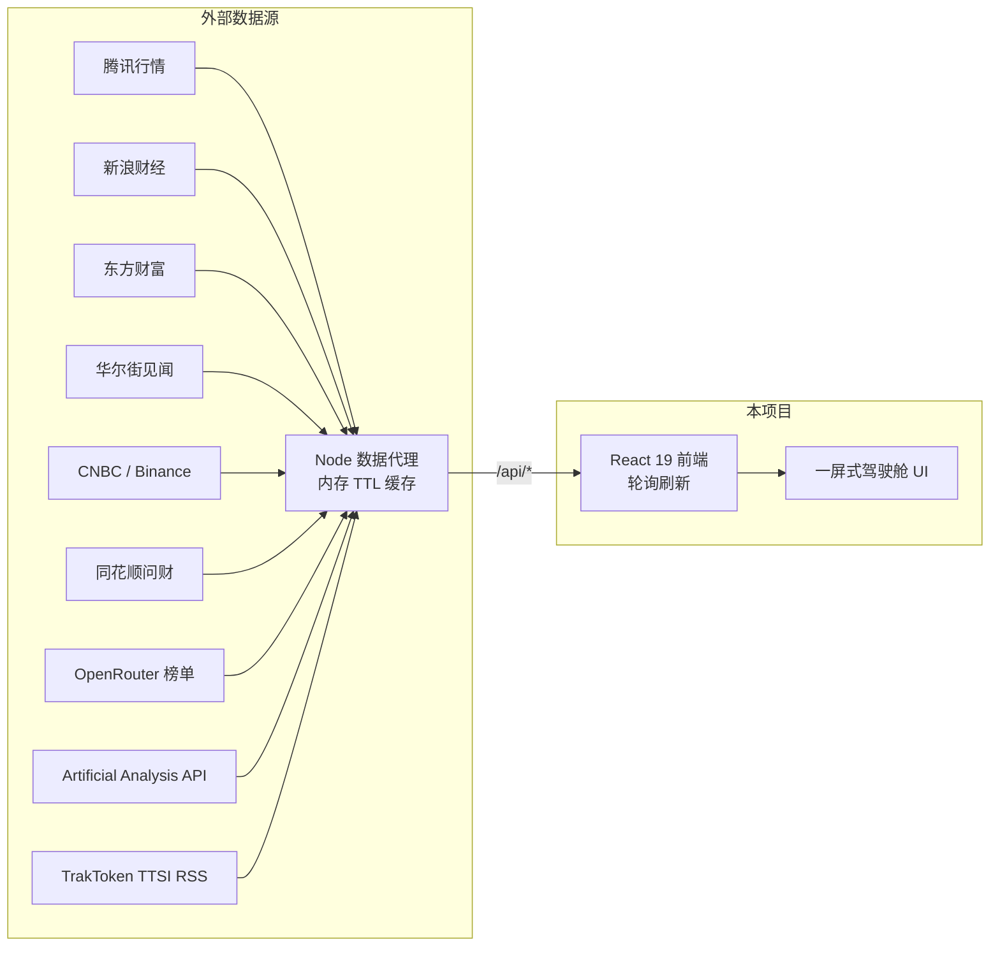

<div align="center">


# 📊 市场研究驾驶舱

**Market Research Cockpit — 面向金融与产业研究的一屏式实时行情大屏**

聚合 A股 / 港股 / 美股 · 大宗商品 · 美债收益率 · 板块热点 · 资金流 · 7×24 快讯 · 产业链自选股

[English](README.md)

[](https://react.dev)
[](https://vite.dev)
[](https://www.typescriptlang.org)
[](https://tailwindcss.com)
[](https://nodejs.org)
[](https://github.com/theBigGavin/marketingdashboard)
[](LICENSE)

</div>


🏠 **来自 Gavin's Lab** — 一家由 7 个 AI agent 通过 kanban board 协作运转的一人公司：[公司官网](https://www.hermes.cc.cd) · [透明办公室（LIVE）](https://www.hermes.cc.cd/opc/)

🛎️ **托管版筹备中** — 暂无定价、暂无上线日期。不想自己维护服务器？欢迎在 [GitHub Issues](https://github.com/theBigGavin/marketingdashboard/issues) 告诉我们你最看重什么。开源自托管版永久免费（MIT），不会变。

## ✨ 功能亮点

- **🌍 全球市场一屏掌握** — 沪深 / 恒生 / 道琼斯 / 纳斯达克 / 标普 / VIX / 美元人民币汇率，指数分钟级走势同屏联动
- **🥇 大宗商品与加密货币** — 纽约金银、伦敦金、沪金、伦铜、原油、BTC，价格与日内曲线实时刷新
- **💵 美债收益率监控** — 10Y / 2Y 收益率、2s10s 利差、收益率曲线形态与历史月度变迁
- **🔥 板块热点雷达** — 行业 / 概念板块涨跌排行，点击板块联动成分股、龙头股与资金流
- **💰 资金流向追踪** — 个股主力净流入 TOP 榜、板块资金分钟级累计曲线、热门股 / 涨幅 / 跌幅榜单
- **⛓️ 产业链全景** — 半导体、AI 算力、新能源车、机器人、创新药等产业链，上中下游标的分层展示并联动行情。支持手动编辑或从问财自动获取股票列表
- **🤖 AI 观察** — OpenRouter 日度榜单 API，追踪全球 50+ 大模型厂商 Token 消耗量趋势（支持 7d~1y 时间范围），按厂商/国家/地区堆叠面积图展示份额变化，支持 60 天以上超长历史回溯
- **💹 大模型价格竞争观察** — 2×3 网格四个面板：TTSI 支出指数趋势（全市场加权 / 闭源前沿 / 开源权重三线，纵轴从 0 起，本地 `ttsi.csv`（CC BY 4.0）全量历史与 RSS 日更尾部合并）、大模型价格表（约 400 个模型，智能/输入/输出/任务成本可排序）、性价比散点（智能指数 × 任务成本对数轴，厂商配色）、降价/份额变动事件流（TrakToken 每日标注）
- **🪟 财报窗口（/fin）** — 财报季宏观视角：财报披露日历（14 天柱状节奏 + 今日清单）、业绩预告（预喜/预悲统计条 + 净利区间明细）、行业盈利榜（规模 × 景气度双编码）、个股盈利榜（净利额/增速切换），以及单公司近 12 期财报趋势（营收净利柱线 + ROE/毛利率/净利率）
- **🏷️ 商品价格页（/goods）** — 贵金属 / 基本金属 / 黑色 / 能化 / 农产品 / 国际能源 6 大分组期货主力日线趋势（新浪全历史 K 线，30d~365d 区间切换），生意社现货日度报价（历史逐日积累）与现期基差对照表
- **📰 7×24 快讯聚合** — 全球财经快讯滚动播报，宏观关键词与产业链关联新闻自动高亮
- **🖥️ 可安装为桌面应用** — 内置 PWA 支持（Web Manifest + Service Worker），浏览器地址栏一键安装，独立窗口运行
- **📺 Android TV 客户端** — 原生 WebView 壳（`android-tv/`），遥控器空间导航、面板全屏放大（比例缩放+幻灯片切换）、翻牌跑马灯，适配老内核与弱 GPU
- **📱 iOS Scripting 脚本** — TypeScript/TSX 脚本（`scriptable/`，镜像至 `theBigGavin/mrd-scripting`），在 Scripting App 的 WebView 中呈现驾驶舱：`?tv=1` TV 模式、强制横屏、忽略安全区全屏、液态玻璃退出按钮、本地开屏页（mrd logo 呼吸动画）且无白屏无缝进入实时页面
- **⚡ 零依赖数据服务** — 内置 Node 代理聚合公开行情接口，内存缓存减压，大部分接口无需 API Key，开箱即用

## 🆚 聚合型面板 vs 单一官方数据源

金融数据工具大致分两类：**官方数据服务**（单一厂商出品、API 形态、需注册申请 Key，适合深度数据接入）和**聚合型面板**（多源公开数据聚合一屏、开箱即用，适合看盘与研究）。mrd 属于后者。两类并不互斥，但如果你想要的是「打开就能看」，差异在这五处：

| 维度 | 单一官方数据源 | mrd（聚合型面板） |
| --- | --- | --- |
| **数据广度** | 一家厂商的数据 | 腾讯 / 新浪 / 东方财富 / 华尔街见闻 / CNBC / Binance / 生意社等十余个公开源聚合一屏，A股 / 港股 / 美股 / 商品 / 美债同屏对照 |
| **可用性** | 上游服务挂了，就是挂了 | 缓存降级：服务端按接口 TTL 缓存 + 失败退避负缓存，上游抖动时仍展示最近一次可用数据；部分接口自动降级为浏览器直连 |
| **选股方式** | 清单式查询 | mystery_select 惊喜选股：一句概念 / 行业描述，筛出一组候选标的 |
| **上手成本** | 需注册官网、申请并保管 API Key | 零 Key 开箱即用：`npm start` 之后就是一屏行情（仅 AI 观察类面板可选配 Key） |
| **运维成本** | 自己接 API、自己搭展示层 | 开源自托管单进程即可跑；不想自己运维，托管版 Pro 正在筹备中 |

> 需要批量历史数据落库、合规审计级数据血缘的场景，官方数据服务更合适；需要一屏盯盘、跨市场对照、打开即用的场景，聚合型面板更合适。

## 🏗️ 架构



- 前端优先请求本站 Node 代理；代理不可用时，部分接口（腾讯系 / 见闻）自动降级为浏览器直连
- **前端统一报价中心**：所有面板的价格 / 涨跌幅由单一客户端报价中心（`src/lib/market.ts`）按 5s 批量拉取并分发同一快照，同一只股票全站同帧；服务端报价按代码独立缓存（5s，与客户端轮询周期对齐），集合变化只补新码
- 服务端按接口粒度设置缓存 TTL（行情 5s ~ 板块归属 24h），缓存容量有界（LRU + 定时清扫），无数据库、无外部存储
- **多用户并发友好**：按代码 TTL 缓存 + inflight 去重（并发缓存失效共享同一次上游拉取）、上游失败退避（5s→2min 负缓存，宕机时不再被反复锤打）、浏览器直连兜底按 code 节流、`/api/stats` 暴露请求数/上游调用数/429 计数
- 现货价格由服务端每 4 小时定时采集并写入本地历史文件，无需前端在线，历史随天数自然生长
- 生产环境单进程运行：同一端口同时提供 API 与前端静态文件

## 🚀 快速开始

### 先决条件

- Node.js 18+
- 系统可用 `curl`（部分代理接口使用）

### 本地开发

```bash
npm install     # 或 pnpm install
npm run dev
```

- 前端开发服务器：<http://localhost:3000>
- 数据代理服务：<http://localhost:3001>（Vite 自动将 `/api` 代理过去）

### 生产部署

```bash
npm run build   # 构建到 dist/
# 可选：配置 API Key（AI 相关面板）
#   echo 'OPENROUTER_API_KEY=sk-or-v1-xxxx' > server/.env          # AI 观察用量面板
#   echo 'ARTIFICIAL_ANALYSIS_API_KEY=aa_xxxx' >> server/.env      # 大模型价格面板
# 可选：TTSI 全量历史 — 从 traktoken.com 下载 ttsi.csv 放到
# server/data/ttsi.csv（CC BY 4.0）；没有时趋势面板自动降级为 60 天 RSS 尾部
npm start       # 单进程启动，访问 http://localhost:3000
```

### Docker

```bash
docker build -t market-cockpit .
docker run -p 3000:3000 market-cockpit
```

### 安装为桌面应用（PWA）

用 Chrome / Edge 打开部署后的页面，点击地址栏右侧的 **安装图标**（或菜单 →「安装市场研究驾驶舱」），即可作为独立桌面应用运行，支持离线缓存静态资源、独立图标。

> 注意：行情接口实时拉取，离线状态下仅应用外壳可用。

### Android TV 客户端

`android-tv/` 目录是一个原生 WebView 壳 App（零第三方依赖），把驾驶舱搬上安卓电视/盒子。Web 端通过 `?tv=1` 进入 TV 模式，与桌面版共用同一套代码。

**遥控器操作模型**

- **方向键空间导航**：面板、导航链接、页签、滚动区均可聚焦（青色高亮框），按"边缘间距 + 轴向重叠"几何打分，正对面板优先
- **OK 键**：放大面板 / 激活按钮 / 切换页面
- **放大 = 全屏浮层**：面板带遮罩盖满全屏，内容按原始比例整体放大（CSS zoom，上限 3x），其他面板零重排
- **放大态内**：←/→ 幻灯片式切换相邻面板；↑/↓ 滚动内容（滚到顶再按 ↑ 直达页签区）；页签、板块行、成分股侧栏均可用方向键到达并操作
- **返回键**：还原放大面板 → 返回上一页 → 退出；**菜单键**：修改服务器地址
- **翻牌跑马灯**：顶部行情带为航班时刻牌风格——7 个等宽卡片槽位，每隔几秒一个槽位单独翻牌轮换（弱 GPU 扛不住全宽连续滚动，翻牌只重绘小区域）
- **开屏页**：Logo 呼吸动画 + 加载进度，页面就绪后淡出

**TV 模式适配要点**（对桌面端零影响）

- 固定 1920 CSS 像素视口，任意密度电视布局与字号一致；壳 App 按屏幕 dp 宽度计算初始缩放恰好铺满
- 旧内核兼容（< Chromium 88）：`:where()`/`inset`/flex `gap` 均有传统写法兜底
- 弱 GPU 优化：禁用毛玻璃/阴影/全局动画，时钟与倒计时降为分钟级，长列表行数收紧（板块 200→40、快讯 60→25、榜单 30→15），报价轮询 5s→10s
- 左下角调试角标：WebView 内核版本 · 构建时间 · 实时 FPS · JS 堆内存 · 报价心跳（区分"轮询异常"与"休市静止"）

**使用步骤**

1. 构建 APK：`cd android-tv && ./gradlew assembleDebug`，产物在 `app/build/outputs/apk/debug/app-debug.apk`
2. 侧载安装到电视（adb：`adb install app-debug.apk`，或 U 盘拷贝安装）
3. App 默认连接公网部署地址 `https://mrd.hermes.cc.cd`，开箱即用；按遥控器菜单键可随时改为局域网地址（电脑端 `npm start` 后填 `http://<电脑IP>:3000`）

### iOS Scripting 脚本

`scriptable/` 目录包含一个 **Scripting App**（scripting.fun）脚本，用原生 WebView 呈现驾驶舱；同时镜像为独立仓库 [`theBigGavin/mrd-scripting`](https://github.com/theBigGavin/mrd-scripting)，可直接导入。

**特性**
- 加载 `https://mrd.hermes.cc.cd/?tv=1`——TV 模式（D-pad 空间导航、点面板放大、触屏滑动切换）
- 强制横屏、无标题栏、忽略安全区全屏（`ignoresSafeArea`）
- 液态玻璃退出按钮（`buttonStyle="glass"`，需 iOS 26）
- 本地开屏页：mrd logo 呼吸动画 + 进度圈，随后无缝深色过渡进入仪表盘（无白屏闪烁）

**一键安装**

iPhone 上打开导入链接（需已安装 Scripting App，iOS 26+）：

```
https://scripting.fun/import_scripts?urls=%5B%22https%3A%5C%2F%5C%2Fgithub.com%5C%2FtheBigGavin%5C%2Fmrd-scripting%5C%2Ftree%5C%2Fmain%22%5D
```

或直接分享 `scriptable/` 下的 `mrd-dashboard.scripting` 文件导入。若脚本宝中已存在同名脚本，请先删除再导入，避免缓存冲突。

**重新打包**：`.scripting` 本质是 zip（STORE 存储、`flag_bits=2048` UTF-8 文件名、zip 版本 20、DOS 日期 2020），内含 `index.tsx`、`page.tsx`、`script.json`。用 `python3 scriptable/package.py` 重建。

## 📡 API 一览

开发时前端通过 `/api` 访问本地代理服务：

| 接口 | 说明 |
| --- | --- |
| `/api/quotes?codes=...` | 指数 / 个股实时报价 |
| `/api/minute?code=...` | 日内分钟走势 |
| `/api/boards?type=...&dir=...&n=...` | 行业 / 概念板块排行 |
| `/api/board-stocks?code=...&n=...` | 板块成分股 |
| `/api/futures?list=...` | 大宗商品 / 加密货币报价 |
| `/api/future-minute?code=...` | 期货日内走势 |
| `/api/future-daily?code=...&n=...` | 期货日线 K 线（默认近 400 根，内盘 nf_ / 外盘 hf_） |
| `/api/spot-table` | 生意社现期对照表（现货价 / 期货价 / 基差，现货历史逐日积累） |
| `/api/chem-spot?id=...&name=...` | 生意社化工现货报价（市场价中位数，历史逐日积累） |
| `/api/rank?sort=...&n=...` | 个股榜单（涨幅 / 成交额 / 换手率） |
| `/api/moneyflow?n=...` | 个股主力净流入排行 |
| `/api/stock-flows?codes=...` | 批量个股资金流 |
| `/api/board-flow?n=...` | 板块资金流向曲线 |
| `/api/stock-boards?code=...` | 个股所属板块（行业 / 地域 / 概念） |
| `/api/news?page=...&size=...` | 7×24 财经快讯 |
| `/api/treasuries` | 美债收益率实时值 |
| `/api/treasury-history` | 美债收益率历史月末曲线（2001 年至今，代码库本地存档 `server/treasury-rates/` + 当年在线补充） |
| `/api/mystery-select?query=...&limit=...` | 问财股票筛选（按概念/行业查询） |
| `/api/finance-main?code=...` | 单公司近 12 期财报主指标（东财 F10，营收/净利/ROE/毛利率等） |
| `/api/finance-board?period=...` | 财报宏观数据包（个股盈利榜 TOP50 + 行业聚合 TOP15 + 近期披露日历） |
| `/api/finance-forecast?period=...` | 业绩预告（净利区间/同比/类型 + 预喜预悲统计） |
| `/api/chain-parse` | 产业链文本解析（按段落标题自动分配上中下游） |
| `/api/openrouter-usage` | OpenRouter 日度榜单（厂商 Token 消耗量，本地缓存持久化积累） |
| `/api/aa-models` | Artificial Analysis 全模型定价（约 600 个模型：智能指数/每百万输入输出价/任务成本；24h 缓存 + 每日快照积累到 `server/data/model-prices.json`） |
| `/api/spend-index` | TrakToken TTSI 支出指数（本地 `ttsi.csv` 全量历史 + RSS 日更尾部合并，含降价/份额变动事件） |
| `/api/stats` | 运行观测：请求数 / 上游调用数 / 429 计数、运行时长 |
| `/api/stock-search?q=...` | 股票搜索（名称/拼音首字母→代码，新浪建议代理） |
| `/api/health` | 健康检查 |

> 注：`/api/mystery-select` 与 `/api/openrouter-usage` 消耗服务端私有 API Key，仅接受同源页面请求（跨源 403）；`/api/aa-models` 需要 `server/.env` 配置 `ARTIFICIAL_ANALYSIS_API_KEY`，端点本身保持公开（24h 缓存）。全站 API 仅向同源页面反射 CORS Origin（跨源浏览器读取不授权），并按客户端 IP 限流（公开端点 2400 次/分、私有端点 30 次/分，超限 429；经 Cloudflare Tunnel 部署时真实 IP 取 `CF-Connecting-IP`）；POST 请求体上限 256KB；`/api/` 未命中路由返回 404 JSON。

## 🗂️ 项目结构

```
├── server/
│   ├── dev.cjs        # 开发入口：同时启动 Vite 与数据代理
│   ├── index.cjs      # 数据代理 + 生产静态文件服务
│   └── data/          # 运行时积累数据（gitignore）：spot-history.json、
│                      #   model-prices.json、ttsi.csv（可选 TTSI 全量历史）
├── src/
│   ├── App.tsx        # 大屏布局与路由（/ 市场驾驶舱、/ai AI观察、/goods 商品价格、/fin 财报窗口）
│   ├── AiDashboard.tsx    # AI 观察页（2×3 网格：Token 消耗跨两行一列 + 4 个大模型价格面板）
│   ├── FinDashboard.tsx   # 财报窗口页（面板见 components/dash/fin/）
│   ├── GoodsDashboard.tsx # 商品价格页（6 分组趋势面板 + 现货/基差面板）
│   ├── components/
│   │   └── dash/      # 驾驶舱各面板（指数/板块/资金流/快讯/产业链/AI观察/自选股/商品趋势…）
│   │       ├── Spark.tsx       # 迷你走势图（A股按交易时段 / 24h 连续时间轴 / 日线按点均分）
│   │       └── WatchlistPanel.tsx  # 自选股面板（支持名称/拼音搜索，localStorage 持久化）
│   ├── config/        # 指数、商品、产业链等静态配置
│   ├── hooks/         # usePolling / useSharedPolling / useClock 等通用钩子
│   └── lib/           # API 客户端、统一报价中心(market.ts)与工具函数
└── docs/              # 截图等文档资源
```

## 🛠️ 技术栈

- **前端**：React 19 · Vite 7 · TypeScript · Tailwind CSS · lucide-react 图标（图表为手写 SVG）
- **后端**：Node.js 原生 `http`（无框架）· `curl` / `fetch`
- **数据源**：腾讯 · 新浪 · 东方财富 · 华尔街见闻 · CNBC · Binance · 生意社 · OpenRouter · Artificial Analysis · TrakToken 等公开行情接口

## ⚠️ 免责声明

本项目仅用于学习与研究目的。所有行情数据来自公开网络接口，可能存在延迟或误差，不构成任何投资建议。

## 🤝 贡献

欢迎提交 Issue 或 PR：

1. Fork 本仓库
2. 创建分支 `feature/xxx`
3. 提交修改并推送
4. 发起 Pull Request

## 📄 License

## Star History

<a href="https://www.star-history.com/?repos=theBigGavin%2Fmarketingdashboard&type=date&legend=top-left">
 <picture>
   <source media="(prefers-color-scheme: dark)" srcset="https://api.star-history.com/chart?repos=theBigGavin/marketingdashboard&type=date&theme=dark&legend=top-left&sealed_token=dBzGp13q5WXRY2nMzJx6pYXb47s2aeyPcdT5LjDYHCmoQuFJjufDDhjF2laPizeEk14vFH6zTsh5r70wFDMc3_rnNmoEvWRadKI0-D-R4aY9EYZUJhSB4fyhjvQvzCQfFUEGZFypsiwhBAbcfBriRgP5_e1vogjMSMnUJyAoHdSVcLcrOMXpQCDOKL_a" />
   <source media="(prefers-color-scheme: light)" srcset="https://api.star-history.com/chart?repos=theBigGavin/marketingdashboard&type=date&legend=top-left&sealed_token=dBzGp13q5WXRY2nMzJx6pYXb47s2aeyPcdT5LjDYHCmoQuFJjufDDhjF2laPizeEk14vFH6zTsh5r70wFDMc3_rnNmoEvWRadKI0-D-R4aY9EYZUJhSB4fyhjvQvzCQfFUEGZFypsiwhBAbcfBriRgP5_e1vogjMSMnUJyAoHdSVcLcrOMXpQCDOKL_a" />
   
 </picture>
</a>

[MIT](LICENSE)
